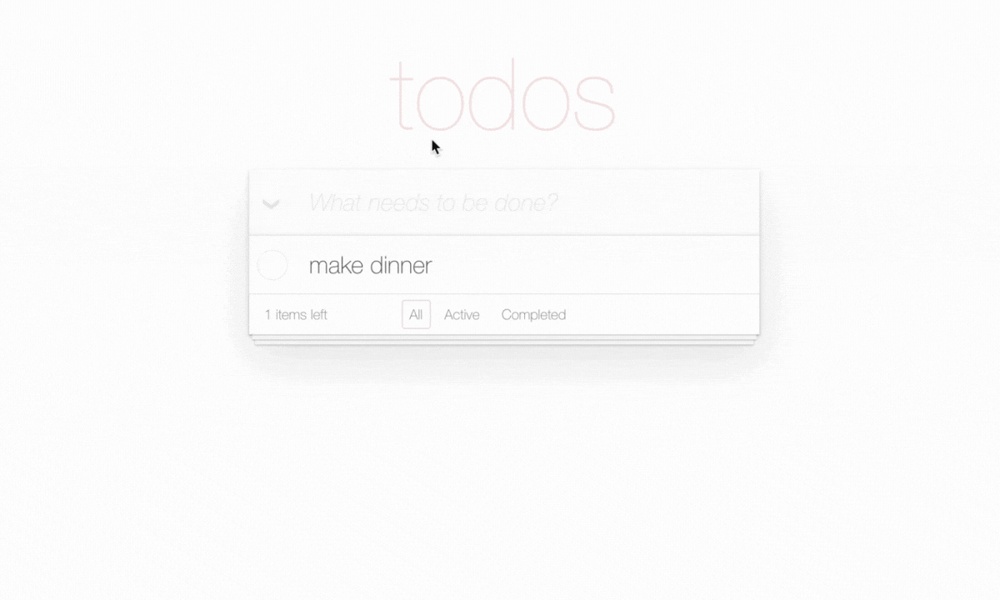
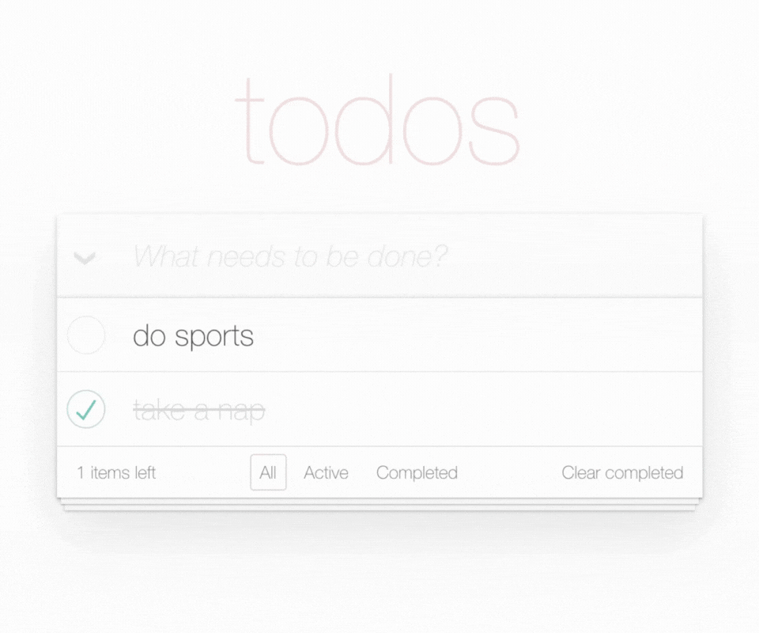
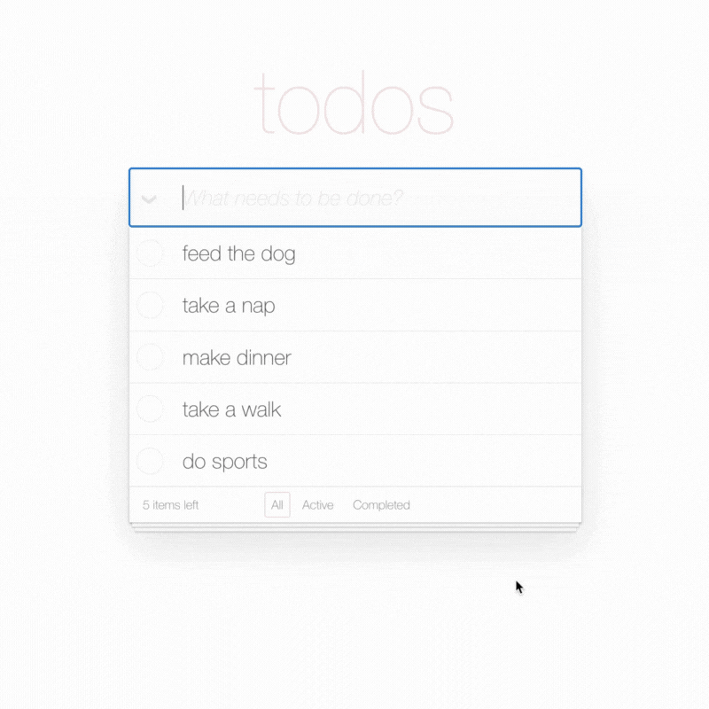
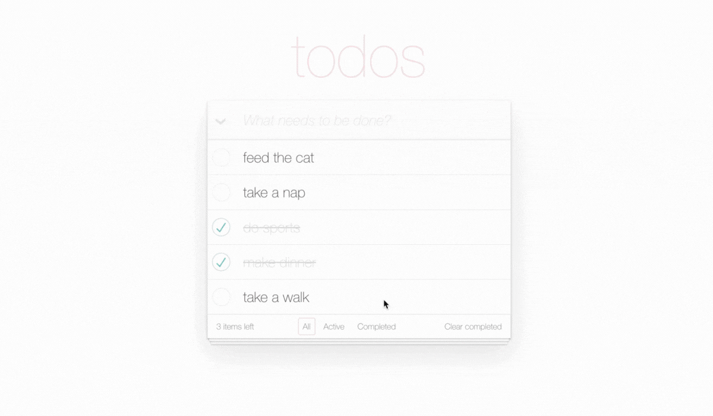

# Todos Manager

A React todos manager that interacts with a REST API for server-side data handling and CRUD operations.

## [Live Demo](https://todos-web.pages.dev/)

## 🛠️ Technical Stack

### Core
- `React` — UI framework
- `TypeScript` — Type safety
- `SCSS`, `Bulma` (CSS framework) — Styling
- `REST API` (Fetch API) — Server communications

### UI/UX & Development
- `React Transition Group` — Animations
- `Vite` — Build tool
- `ESLint` — Linting

## 💡 Key Features
- **Creation**: Server-side todos creation via REST API, triggered by the `Enter` key.

<details>
    <summary><b>Show Technical Demo</b></summary>
    <p align="center">
        
    </p>
</details>

- **Inline Editing**: Double-click to edit todos; `Esc` to cancel and `Enter` to save changes.

<details>
    <summary><b>Show Technical Demo</b></summary>
    <p align="center">
        
    </p>
</details>

- **Deleting**: Individual todo deletion, or bulk toggling to delete all todos at once.

<details>
<summary><b>Show Technical Demo</b></summary>
<p align="center">
    
</p>
</details>

- **Filtering**: Client-side status filtering (All/Active/Completed) with a live count of active todos.

<details>
<summary><b>Show Technical Demo</b></summary>
<p align="center">
    
</p>
</details>

- **Feedback & Error Handling**: Visual loading state for simulated server latency (100ms) and notifications for API or validation failures.

<details>
<summary><b>Show Technical Demo</b></summary>
<p align="center">
    
</p>
</details>

## 🚦 How to Run

```bash
# Clone the repository
git clone https://github.com/home2ego/todos-app.git

# Navigate to directory
cd todos-app

# Install dependencies
npm install

# Run development server
npm run dev